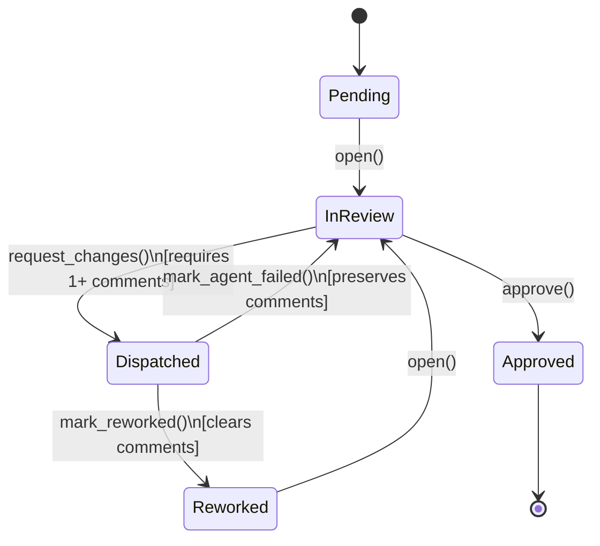

# The Gated Trait -- Cockpit's Review Loop

## Overview

The `Gated` trait is cockpit's core abstraction. It encodes a single review loop as a state
machine with five states and six transitions, and both reviewable objects in the system --
`ProjectPlan` (the plan gate) and `Review` (the diff gate) -- implement it. The loop is
written once. There is no per-gate fork.

This is the design's key differentiator: the plan gate reviews a `PlanDoc`, the diff gate
reviews a PR diff, but both run the same state machine with the same transition rules, the
same comment semantics, and the same dispatch/reconcile contract. Adding a third gate type
(e.g., a deploy gate) means implementing six methods, not reimplementing the loop.

The trait lives in `crates/cockpit-core/src/gate.rs`. The domain types it operates on live
in `crates/cockpit-core/src/model.rs`.

---

## State Machine Diagram



`Pending` is the initial state for every reviewable object. `Approved` is terminal -- once
approved, the object exits the loop and triggers its downstream effect (plan approval spawns
the implementation batch; review approval triggers merge).

The `Dispatched` state has two outbound edges, reflecting the two ways an agent run can end:

- **Success** (`mark_reworked`): the agent finished, the Stop hook fired, the artifact was
  reconciled. Comments are cleared because they have been addressed.
- **Failure** (`mark_agent_failed`): the agent crashed, timed out, or produced no meaningful
  change. Comments are preserved so the reviewer can re-dispatch without re-entering them.

---

## Transition Table

Every legal transition, with its preconditions and postconditions:

| Source state | Event (method)       | Target state | Preconditions              | Postconditions                        |
|--------------|----------------------|--------------|----------------------------|---------------------------------------|
| Pending      | `open()`             | InReview     | --                         | Gate state set to `InReview`          |
| InReview     | `request_changes()`  | Dispatched   | `comments().len() >= 1`    | Gate state set to `Dispatched`        |
| InReview     | `approve()`          | Approved     | --                         | Gate state set to `Approved`          |
| Dispatched   | `mark_reworked()`    | Reworked     | --                         | Comments cleared; state `Reworked`    |
| Dispatched   | `mark_agent_failed()`| InReview     | --                         | Comments preserved; state `InReview`  |
| Reworked     | `open()`             | InReview     | --                         | Gate state set to `InReview`          |

The `open()` method accepts two source states (`Pending` and `Reworked`) since both
represent "ready for (re-)review". All other transitions accept exactly one source state.

---

## Error Cases

Any transition attempted from a state not listed in the table above produces an error.
There are two error variants:

| Error variant       | When it fires                                                      | Example                                       |
|---------------------|--------------------------------------------------------------------|-----------------------------------------------|
| `IllegalTransition` | A transition method is called from a state that does not allow it  | `approve()` called while in `Dispatched`      |
| `NoComments`        | `request_changes()` is called while the comment list is empty      | Reviewer clicks "request changes" with no comments |

The `IllegalTransition` error carries the `from` state and the event name, making it easy to
diagnose in logs:

```
illegal transition from Dispatched on event `approve`
```

The full illegal-transition matrix (every combination of state x event that is rejected) is
covered by the test suite -- see the "Illegal transitions" test blocks in `gate.rs`.

---

## Comment Lifecycle

Comments are **ephemeral** (CLAUDE.md Invariant 4). A comment exists for exactly one
review-to-rework cycle:

1. The reviewer opens the object (`InReview`).
2. The reviewer adds comments, each anchored to a location in the current artifact.
3. The reviewer calls `request_changes()`, which requires at least one comment.
4. The agent works. The object is now `Dispatched`.
5. On success: `mark_reworked()` **clears all comments**. The artifact has changed; the old
   anchors no longer apply.
6. On failure: `mark_agent_failed()` **preserves all comments**. The artifact has not changed,
   so the anchors are still valid. The reviewer can re-dispatch immediately or add more
   comments first.

There is no `resolved` flag on comments. There is no durable SHA-based anchoring. Comments
point to the *current* artifact version only. This keeps the model simple: when the artifact
changes, stale comments vanish rather than becoming phantom references to old code.

The `Anchor` enum determines where in the artifact a comment points:

- `PlanStep(usize)` -- a step in the plan, by zero-based index (plan gate).
- `PlanFile(PathBuf)` -- a file in the plan's intended touch set (plan gate).
- `DiffLine { path, range }` -- a line range in the current diff (diff gate).

---

## Stale Flag

The `stale` flag is **orthogonal to gate state**. It exists on `Review` only (not
`ProjectPlan`) and answers a different question: "is this review's artifact potentially
outdated because a parent branch is being reworked?"

### When stale is set

A review is marked stale when one of its ancestors in the stack enters `Dispatched`. The
parent's code is about to change, which means this review's base will shift. Deep-reviewing
it now would be premature -- the diff will change after restack.

### When stale is cleared

After the parent reaches `Reworked` and a restack of this review's branch succeeds, the stale
flag is cleared. The review's diff now reflects the updated base.

### Stale does not block transitions

A stale review can still transition through the loop normally. The flag gates the **frontier**
(what the UI surfaces as ready for deep review), not the state machine itself. The test suite
verifies this: a stale review can call `request_changes()`, `approve()`, and every other
transition method without error.

### API

```rust
impl Review {
    pub fn mark_stale(&mut self);   // set stale = true
    pub fn clear_stale(&mut self);  // set stale = false
}
```

These are plain methods on `Review`, not part of the `Gated` trait, because staleness is a
DAG-level concern specific to stacked PRs.

---

## Implementors

The `Gated` trait requires six methods. Four are accessor plumbing; two are effectful
operations that vary per gate type.

### Required methods

| Method             | Purpose                                                        |
|--------------------|----------------------------------------------------------------|
| `gate_state()`     | Return the current `GateState`                                 |
| `comments()`       | Borrow the current comment list                                |
| `gate_state_mut()` | Mutably borrow the gate state (used by default transition methods) |
| `comments_mut()`   | Mutably borrow the comment list (used by `mark_reworked` to clear) |
| `dispatch()`       | Assemble the prompt and spawn the agent in its worktree        |
| `reconcile()`      | After the Stop hook: re-read the artifact, then finalize       |

### Default methods (the transition logic)

The five transition methods -- `open()`, `request_changes()`, `approve()`, `mark_reworked()`,
and `mark_agent_failed()` -- are default methods on the trait. They enforce the transition
table and are never overridden. This is how "one loop, written once" is enforced at the type
level.

### Review (diff gate)

`Review` stores its gate state and comments as struct fields. Its `dispatch()` assembles a
rework prompt from the review's comments and the current diff, then spawns an agent in
`AgentMode::Fix` in the review's worktree. Its `reconcile()` re-reads the git state after
the agent pushes.

### ProjectPlan (plan gate)

`ProjectPlan` stores its gate state and comments as struct fields. Its `dispatch()` assembles
a plan-revision prompt from the comments and current `PlanDoc`, then spawns an agent in
`AgentMode::Plan`. Its `reconcile()` re-parses the plan document from the agent's output.

Both implementations currently stub `dispatch()` and `reconcile()` with
`Err(Error::NotImplemented)` -- the adapter wiring is built in later phases (T1.1 through
T1.3).

---

## Code Reference

All source lives in `crates/cockpit-core/src/`:

- **`gate.rs`** -- The `Gated` trait definition (line 38), the `Error` enum (line 12),
  default transition methods (lines 66-135), `impl Gated for Review` (line 142),
  `impl Gated for ProjectPlan` (line 172), stale flag methods (lines 202-216), and the
  test suite (lines 222-609).

- **`model.rs`** -- The `GateState` enum (line 82), `Review` struct (line 255),
  `ProjectPlan` struct (line 236), `Comment` struct (line 200), `Anchor` enum (line 125),
  and all newtype IDs.

The test suite covers every legal transition, every illegal transition (the full 5-state x
5-event matrix minus the six legal edges), the `NoComments` guard, comment clearing on
`mark_reworked`, comment preservation on `mark_agent_failed`, full review lifecycle, agent
failure with re-dispatch, and the stale flag's orthogonality to gate state. Both `Review` and
`ProjectPlan` are exercised to verify the trait is truly shared.
